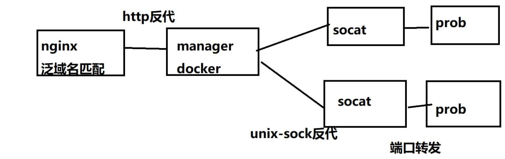

# GeekGame 动态 Web 类题目容器管理

本项目是基于 Hackergame 的动态容器管理修改而来，基本用法可以参考[原项目](https://github.com/USTC-Hackergame/hackergame-challenge-docker)。

项目附带的测试证书和原项目一致，但本项目使用的是 urlsafe-base64。你可以使用测试 Token： `1:MEUCIQCjK1QcPFro86w3bKPb5zUZZd96ocp3EZDFcwLtJxNNDAIgEPk3Orw0mE-zHLQA7e31kSFupNtG9uepz2H4EqxlKWY=`

## 设计思路

本项目主要应对的场景是 CTF 比赛中部分 Web 类题需要分不同队伍开可持久化容器的场景。参照 Hackergame 的设计思路，题目平台应和容器管理分离，因此就有了此项目作为专门的 Web 容器管理服务，在容器服务器上运行。服务使用 Token 进行鉴权和持久化状态的维护，用户可以使用 Token 请求开启或关闭容器。

由于我们环境无法做到开放大量任意端口，传统的根据用户请求动态开 Docker 并绑定到随机端口的方法并不可行（这种方法也有不抗扫描使得可以很容易地访问不属于自己容器的问题），因此我们采用了基于泛域名匹配的反代方案。每一道题运行一个管理服务。外层使用 nginx 根据泛域名匹配来选择反代到哪道题对应的管理服务的容器。管理服务再根据用户访问的域名来选择要反代的题目容器，或在匹配到特殊路径时执行容器管理操作。

题目仍然采用 Docker in Docker 架构。注意题目容器本身的 Docker 也是运行在宿主机下的。为了保证题目服务在重启时，对已经打开的题目实例不会造成影响（事实上去强制关闭所有实例同时维护数据的一致性是很麻烦的，不如不更新正在运行的实例，让选手手动重启），同时避免日志丢失，管理服务需要额外配置一个宿主机上的"数据存储目录"，使得管理服务和题目实例均可访问。

为了避免 Docker 网络本身带来的复杂性，同时也便于防火墙等规则配置，题目服务到实例的连接并不通过 Docker 的网络进行，而是使用 volume 共享 UNIX socket 进行通讯。题目 Docker 通常不应具有任何访问网络中其他地址的能力。题目 Docker 应当侦听 /sock/socat.sock。由于存在（绝大多数）比较懒的出题人不会去直接使用 UNIX socket 进行通讯，且也不会去配置转发，因此管理服务自带了一个转发功能：其会把静态链接的 socat 挂载到题目实例内，并启动一个进程用于转发。

## 使用方法

选手使用方法：访问题目对应的泛域名规则下任意域名的 `/docker-manager/start?TOKEN` 或 `/docker-manager/stop?TOKEN` 来控制容器的启停。

配置方法参照 Hackergame 的项目。同时本项目下也提供了一个 example 的示例题目，可供参考。

本项目配置文件比 Hackergame 原项目要多了很多选项，具体请参照后文。

注意：Dockerfile 中对需要开放的端口不应使用 EXPOSE。如有反代需求可以配置 external_proxy_port。

## 选项说明

只在此说明 Hackergame 原项目中没有出现的，且较为常用且不那么容易配置的选项。大多数选项在题目对应的 .env 文件进行配置。对于完整选项及功能，请参照 manager/.env 并自行阅读源码实现。

- DOMAIN 为题目根域名。位于 manager/main.py 的源码。
- data_dir 为管理服务和题目实例使用的持久化数据存储目录。其会用于存储用户操作数据，共享 UNIX socket，题目实例日志。
- conn_interval 为用户发送容器管理类请求的频率限制。
- challenge_timeout 为容器过期时间。此时间是以上一次访问（数据交换）为参照。即用户在一段时间内没有数据交换后会自动删除容器。
- challenge_docker_name 为题目实例容器镜像名。在默认的 docker-compose 文件下，建议设为"当前目录名_challenge"。
- prob_path 为题目实例开启后跳转到的 URI。实例状态检测也是使用此 URI。项目中钦定使用 HTTPS。
- use_network 为是否开启网络访问。注意，若选择开启，项目的 main.py 中会直接指定使用 problem 网络。这是为了便于配置防火墙。如果有其他需求，请自行修改 start_docker 函数相关代码，以及 docker-compose.yml 网络相关部分。
- disk_limit 为容器实例存储使用限制。注意，这个功能可用依赖于 Docker 数据目录使用的文件系统。具体配置请上网自行查询。如果不需要请自行修改 start_docker 函数关于 --storage-opt 的代码。
- stdout_log 为是否记录题目实例的输出。开启后将会把题目输出的内容作为实例日志存到数据存储目录下。
- external_proxy_port 为使用题目服务提供的 socat 代理时的端口号。通常配置为题目所需要暴露的端口号。如果为 0 则表示不需要题目服务的 socat。

## 已知问题

下列是目前项目的已知问题和不足。如果你有彻底解决某个问题的方法，欢迎 PR。

- 对于较长或者不够规范的 Header（或 URI）无法正确分流。这是因为题目服务为了使得处理便捷，对收到的 HTTP 报头做了一定的假设。通常情况下，在外层经过 nginx 后是没有问题的（如果不经过 nginx 也会有不抗 cc 等问题）。题目服务的处理方式是，一次性接收一定长度的报头，并从中匹配 Host 与 URI。因此对于过长或者不规范的请求无法处理。一个解决办法是修改报头处理方式。
- 对于需要大量请求的题目，socat 反代（甚至题目本身）可能会崩溃。这是因为 socat 使用 fork 的运行方式，而题目又对容器的 pid 数量进行了限制。当未关闭连接过多时，便会将进程限制占满，进而无法创建新的进程，这会导致 socat 无法处理新的请求（部分题目也可能会直接崩溃）。而由于 socat 本身代码的特性，在无法创建新进程时，socat 主进程也会退出，因此题目会完全无法访问。一个解决方法是使用其他程序（例如基于 epoll 的反代），或修改 socat 源码。我尝试了一下发现似乎还是需要费点功夫的。
- 容器内无法拿到用户访问的 IP 以记录日志，或者说无法出让用户伪造 X-Real-IP 头的题目。这是由于架构设计决定的。目前想拿 IP，只能通过最外层 nginx 写入的 X-Real-IP 头进行获取。应该是很难解决。
- 每道题要配置独立的 data_dir 比较麻烦。这个目录主要是在共享 UNIX socket 是会使用。但是若直接将其放置到一个 Docker 内的临时目录，在题目服务重启是会出现旧容器丢失的问题，且可能造成日志数据的不一致。